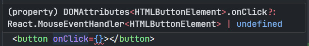

# Simple React Typescript Cheatsheet

- [Simple React Typescript Cheatsheet](#simple-react-typescript-cheatsheet)
  - [Typing props with inline type](#typing-props-with-inline-type)
  - [Typing props with Type](#typing-props-with-type)
  - [Typing props with default value](#typing-props-with-default-value)
  - [Typing props with children](#typing-props-with-children)
  - [Using Native HTML props to React Components](#using-native-html-props-to-react-components)
    - [1. Basic](#1-basic)
    - [2. Combine with your type](#2-combine-with-your-type)
    - [3. Overriding Native Props](#3-overriding-native-props)
    - [4. Extracting Props from Custom Components](#4-extracting-props-from-custom-components)
  - [Typing Event Handlers from native element](#typing-event-handlers-from-native-element)
  - [useState](#usestate)
  - [useCallback](#usecallback)
  - [useRef](#useref)
    - [Basic useRef](#basic-useref)
    - [useRef with HTML element](#useref-with-html-element)
    - [useRef with forwardRef](#useref-with-forwardref)
    - [Making a Read-Only Ref Mutable](#making-a-read-only-ref-mutable)
  - [useReducer](#usereducer)
  - [Context](#context)
  - [Polymorphic](#polymorphic)
  - [Types or Interfaces?](#types-or-interfaces)
  - [Resources](#resources)


## Typing props with inline type

```tsx
function Button(props: { children: React.ReactNode }) {
  return <button>{props.children}</button>;
}
```

## Typing props with Type

```tsx
// you can use interface too
type ButtonProps = {
  className: string;
  children: React.ReactNode;
};

function Button(props: ButtonProps) {
  return <button className={props.className}>{props.children}</button>;
}

// with destructuring
function OtherButton({ className, ...props }: ButtonProps) {
  return <button className={className}>{props.children}</button>;
}
```

## Typing props with default value

```tsx
type ButtonProps = {
  disabled?: boolean;
  className: string;
  children: React.ReactNode;
};

function Button({ disabled = true, ...props }: ButtonProps) {
  return (
    <button disabled={disabled} {...props}>
      {props.children}
    </button>
  );
}
```

## Typing props with children

```tsx
type ButtonProps = {
  // accept everything React can render
  children: React.ReactNode;
};

function Button(props: ButtonProps) {
  return <button>{props.children}</button>;
}
```

## Using Native HTML props to React Components

### 1. Basic

```tsx
import React, { ComponentProps } from "react";

//ComponentProps<"button"> : get all type/props from native button element

function Button(props: ComponentProps<"button">) {
  return <button>{props.children}</button>;
}
```

### 2. Combine with your type

```tsx
import React, { ComponentProps } from "react";

type ButtonProps = ComponentProps<"button"> & {
  variant: "primary" | "secondary";
};

function Button(props: ButtonProps) {
  return <button {...props}>{props.children}</button>;
}
```

### 3. Overriding Native Props

```tsx
import React, { ComponentProps } from "react";

//remove onChange property from input with Omit<Type, Keys> and combine with new type
type InputProps = Omit<ComponentProps<"input">, "onChange"> & {
  onChange: (value: string) => void;
};

function Input(props: InputProps) {
  return <input {...props} />;
}
```

### 4. Extracting Props from Custom Components

Useful when author of some external library dont export the type definition

```tsx
import { ComponentProps } from "react";
import { Navbar } from "some-ui-library";

type NavBarProps = ComponentProps<typeof NavBar>;
```

## Typing Event Handlers from native element

Hover native html props in VSCode, you can copy paste the type definition

```tsx
type ButtonProps = {
  other?: Boolean;
  onClick?: React.MouseEventHandler<HTMLButtonElement>;
};
```



## useState

```tsx
// ❌ Typescript already know `text` type is string
const [text, setText] = useState<string>("");
// ✅ no need to tell typescript, only work with primitive value
const [text, setText] = useState("");
```

```tsx
type Tag = {
  id: number;
  value: string;
};

const [tags, setTags] = useState<Tag[]>([]);
```

```tsx
// data : Data | undefined
const [data, setData] = useState<Data>();
// data : Data | undefined
const [data, setData] = useState<Data>(undefined);
// data : Data | null
const [data, setData] = useState<Data | null>(null);
```

## useCallback

```tsx
function App(props: { id: number }) {
  const handleClick = useCallback(
    //⬇️ add type here
    (message: string) => {
      console.log("name");
    },
    [props.id]
  );

  return (
    <div>
      <p>{message}</p>
      <button onClick={() => handleClick("hello")}>button 1</button>
      <button onClick={() => handleClick("hello")}>button 2</button>
    </div>
  );
}
```

## useRef

### Basic useRef

```tsx
export const Component = () => {
  // pass type if it doesn't have initial value
  const id1 = useRef<string>();
  // no need to pass type if it have initial value
  const id2 = useRef("");

  useEffect(() => {
    id1.current = "Random value!";
  }, []);

  return <div></div>;
};
```

### useRef with HTML element

you can hover over the type of ref in the element to check what it accepts in your editor

```tsx
export const Component1 = () => {
  // add null to initial value
  const ref = useRef<HTMLAudioElement>(null);

  //(property) React.ClassAttributes<HTMLAudioElement>.ref?: React.LegacyRef<HTMLAudioElement> | undefined
  return <audio ref={ref} />;
};

```

alternative using `ElementRef` type helper

```tsx
import { useRef, ElementRef } from "react";
import { OtherComponent } from "./other-component";

// the easy alternative, you can use ElementRef
const Component1 = () => {
  const audioRef = useRef<ElementRef<"audio">>(null);
  return <audio ref={audioRef}>Hello</audio>;
}

// you can use ElementRef for component too
type OtherComponentRef = ElementRef<typeof OtherComponent>;

const Component2 = () => {
  const ref = useRef<OtherComponentRef>(null);
 
 return <OtherComponent ref={ref}>Hello</OtherComponent>;
};

```

### useRef with forwardRef

```tsx
type InputProps = {
  className: string;
};

const MyInput = React.forwardRef<HTMLInputElement, InputProps>((props, ref) => {
  return <input ref={ref} className={props.className} />;
});
// add displayName if you are using function expression, so its has a name in React Devtool
MyInput.displayName = "MyInput";

function App() {
  const input = React.useRef<HTMLInputElement>(null);

  useEffect(() => {
    // focus to input element on first render
    if (input.current) {
      input.current.focus();
    }
  }, []);

  return <MyInput className="input-style" ref={input} />;
}
```

### Making a Read-Only Ref Mutable

```tsx
export const Component = () => {
  const ref1 = useRef<string>(null);
  // if you pass null to initial value
  // this not allowed to change directly
  ref1.current = "Hello";

  const ref2 = useRef<string>();
  // if initial value is undefined this is allowed to change (mutable)
  ref2.current = "Hello";

  return null;
};
```

## useReducer

You can use [Discriminated Unions](https://www.totaltypescript.com/discriminated-unions-are-a-devs-best-friend) for reducer actions. Don't forget to define the return type of reducer, otherwise TypeScript will infer it.

```tsx
import { useReducer } from "react";

const initialState = { count: 0 };

type ACTIONTYPE =
  | { type: "increment"; payload: number }
  | { type: "decrement"; payload: string };

function reducer(state: typeof initialState, action: ACTIONTYPE) {
  switch (action.type) {
    case "increment":
      return { count: state.count + action.payload };
    case "decrement":
      return { count: state.count - Number(action.payload) };
    default:
      throw new Error();
  }
}

function Counter() {
  const [state, dispatch] = useReducer(reducer, initialState);
  return (
    <>
      Count: {state.count}
      <button onClick={() => dispatch({ type: "decrement", payload: "5" })}>
        -
      </button>
      <button onClick={() => dispatch({ type: "increment", payload: 5 })}>
        +
      </button>
    </>
  );
}
```

## Context

```tsx
import { createContext, useState } from "react";

type ThemeContextType = "light" | "dark";

const ThemeContext = createContext<ThemeContextType | null>(null);

//if you have proper default value, you dont need specify null
//const ThemeContext = createContext<ThemeContextType>("light");

const useTheme = () => {
  const theme = useContext(ThemeContext);

  if (!theme) {
    throw new Error(
      "useTheme has to be used within <ThemeContext.Provider>"
    );
  }
  return theme;
};

const App = () => {
  const [theme, setTheme] = useState<ThemeContextType>("light");

  return (
    <ThemeContext.Provider value={theme}>
      <MyComponent />
    </ThemeContext.Provider>
  );
};


const SomeComponent = () => {
   // since the value has been checked inside useTheme, no need checking null value
   const theme = useTheme();
   return <p>current theme: {theme}.</p>;
};
```

## Polymorphic

Imagine a `Button` component that renders a `<button>` element, but with your fancy button styles. If want to render the Button component as an a other element we might have an API like:

```tsx
<Button variantColor="primary" href="https://blog.makerx.com.au/" as="a">
  Click me
</Button>
```

This looks nice, but its not work realy well with typescript. here the alternative using `radix-ui/react-slot`

```tsx

// Button.tsx
import { Slot } from '@radix-ui/react-slot'

type ButtonProps = React.ComponentPropsWithoutRef<'button'> & {
  variantColor: 'primary' | 'secondary' | 'danger'
  asChild?: boolean
}

export const Button = React.forwardRef<HTMLButtonElement, ButtonProps>((props, forwardedRef) => {
  const { variantColor, asChild, ...buttonProps } = props
  const Component = (asChild ? Slot : 'button') as 'button'

  return (
    <Component
      {...buttonProps}
      ref={forwardedRef}
      className={clsx(
          // ...
      )}
    />
  )
}

// App.tsx

function App() {
  return (
    <div>
       {/* asChild must be true */}
      <Button variantColor="primary" asChild>
        {/* render button component as link */}
        <a href="https://google.com">About</a>
      </Button>
    </div>
  )
}
```

## Types or Interfaces?

`interface`s are different from `type`s in TypeScript, but they can be used for very similar things as far as common React uses cases are concerned. Here's a helpful rule of thumb:

- Always use `interface` for public API's definition when authoring a library or 3rd party ambient type definitions.

- Consider using `type` for your React Component Props and State, because it is more constrained.

Types are useful for union types (e.g. `type MyType = TypeA | TypeB`) whereas Interfaces are better for declaring dictionary shapes and then `implementing` or `extending` them.

## Resources

- [React Total Typescript](https://www.totaltypescript.com/tutorials/react-with-typescript)
- [Discriminated Unions are a Frontend Dev's Best Friend](https://www.totaltypescript.com/discriminated-unions-are-a-devs-best-friend)
- [Other React TypeScript Cheatsheets
  ](https://react-typescript-cheatsheet.netlify.app/)
